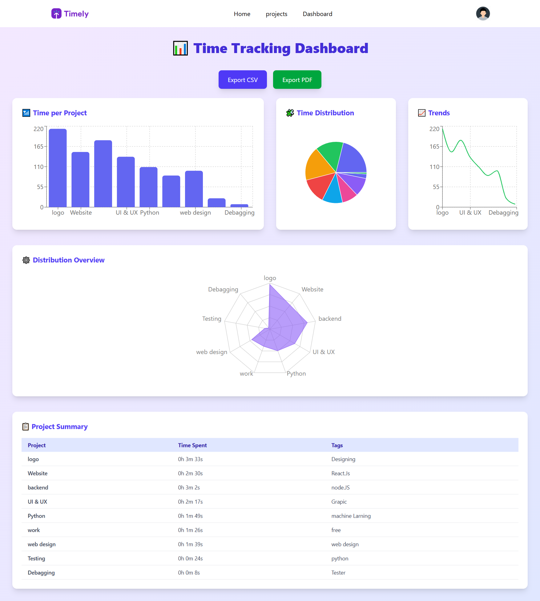
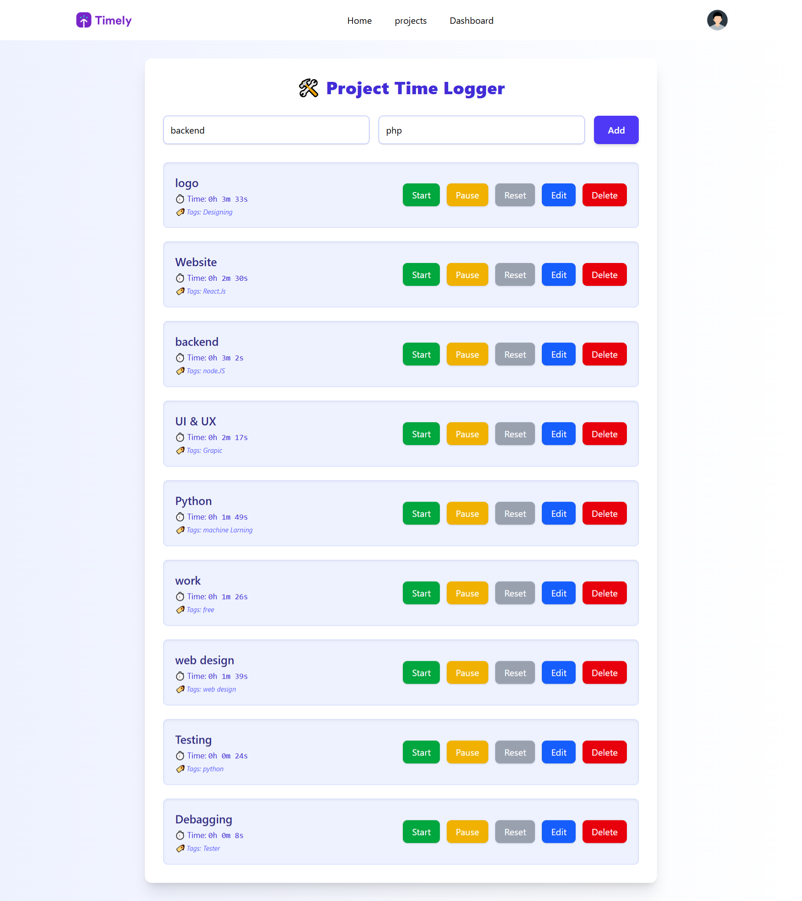

# 📘 Freelancer Time Tracking Web App - README

A responsive and colorful ReactJS web application designed to help freelancers track their project work, visualize data, and export professional reports.

---

## 🚀 Features

- ⏱️ **Project Time Logging** with live Start, Pause, Reset controls
- 🏷️ **Project Tagging** system
- 📊 **Interactive Dashboard** with:

  - Bar Chart
  - Pie Chart
  - Line Chart
  - Radar Chart

- 📋 **Weekly Summary Table**
- 📤 **Export Options**:

  - CSV (Weekly Report)
  - PDF (Styled Report)

- 🌈 **Colorful Tailwind CSS Styling**

---

## 🧠 Technologies Used

- ReactJS (with Hooks)
- Tailwind CSS
- Recharts
- jsPDF & jsPDF-AutoTable
- react-csv
- LocalStorage for data persistence

---

## 🛠️ Setup Instructions

### 1. Clone the Repo

```bash
git clone https://github.com/imranmalakzai/freelancer-time-tracker.git
cd freelancer-time-tracker
```

### 2. Install Dependencies

```bash
npm install
```

### 3. Run the App

```bash
npm run dev
```

The app will be live at: `http://localhost:5173` (or appropriate port).

---

## 📦 Project Structure

```
├── src
│   ├── App.jsx
│   ├── Dashboard.jsx         # Full dashboard with charts and summary
│   ├── ProjectsPage.jsx      # Page for adding/editing projects and timers
│   ├── main.jsx              # React entry point
├── public
│   └── index.html
├── package.json
└── tailwind.config.js
```

---

## 📝 Data Storage

- Project names, timers, and tags are stored in `localStorage`
- Ensures persistence between sessions

---

## 📈 Graphs

- **Bar Chart:** Total time per project
- **Pie Chart:** Percentage distribution
- **Line Chart:** Time trend per project
- **Radar Chart:** Overall distribution pattern

---

## 📄 Exported Reports

### PDF

- Styled with header, color, and auto-table format
- Filename: `weekly_project_summary.pdf`

### CSV

- Clean and structured format
- Filename: `weekly_project_summary.csv`

---

## 🔐 Authentication

Authentication & user settings (login/logout) are planned for future enhancements (e.g., Firebase Auth).

---

## 📅 Coming Soon

- Google Calendar Integration (API)
- Firebase/Backend sync option
- User Profile + Dark Mode

---

## 👨‍💻 Author

**Imran Malakzai**
GitHub: [your-github-profile](https://github.com/imranmalakzai)

---

## Live Demo 🎈

- https://freelancer-time-tracker.netlify.app

## 📜 License

MIT License - Feel free its a free License.

#project Images 💖
;
;
